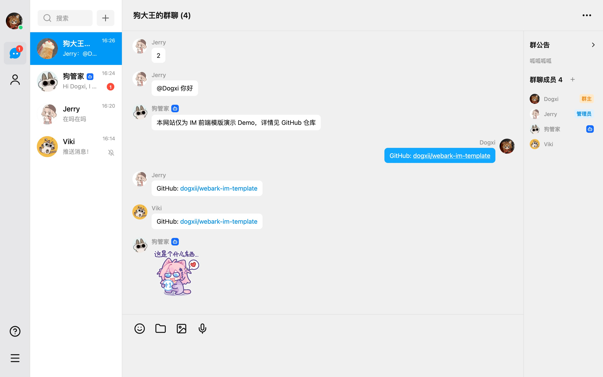
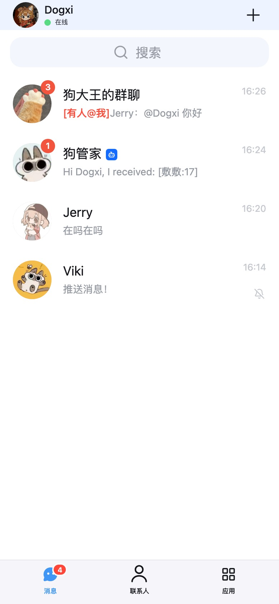
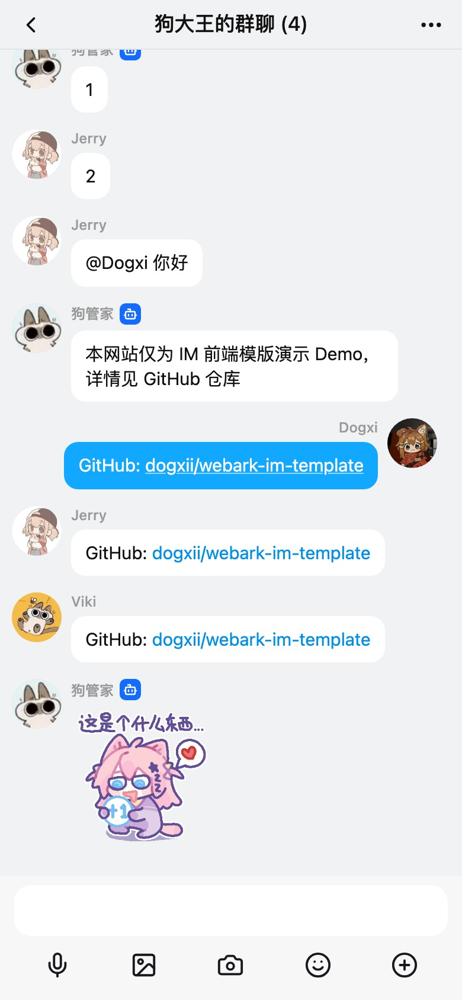

<p align="center">
  
</p>

<h1 align="center">Webark IM Template</h1>

<p align="center">
  一个开箱即用的 React IM 前端模板。内置桌面三栏、移动端聊天、联系人、群资料、设置、帮助、Markdown 消息、表情、@ 提及和本地 demo 数据。
</p>

<p align="center">
  <a href="https://github.com/dogxii/webark-im-template"></a>
  
  
  
  
  
</p>

<p align="center">
  <a href="https://im-template.dogxi.me">在线体验</a> ·
  <a href="#-为什么用">为什么用</a> ·
  <a href="#-快速开始">快速开始</a> ·
  <a href="#-如何套用">如何套用</a> ·
  <a href="https://github.com/dogxii/webark-im-template/issues">反馈建议</a>
</p>

## 🖼️ 预览



<p align="center">
  
  
</p>

## ❓ 为什么用

- 完整 IM 前端骨架：会话列表、聊天窗口、联系人、群聊详情、资料页和设置页。
- 同时适配桌面端和移动端，默认就是可体验的聊天界面。
- 纯前端 demo，无数据库，无自建后端，拉下来即可运行。
- 组件和状态边界清晰，方便接入自己的登录、API、上传、通知和机器人能力。
- 提供工具页、消息渲染、输入框按钮、资料操作和设置面板等轻量扩展入口。

## 🚀 快速开始

```bash
bun install
bun run dev
```

默认访问：

```text
http://localhost:5173
```

生产构建：

```bash
bun run build
bun run preview
```

## 🧩 如何套用

从模板入口引入核心组件：

```ts
import {
  ChatShell,
  ChatSidebarContent,
  ChatMainContent,
  useChatShellController
} from "./src/template";
```

你只需要传入用户、联系人、会话、消息和回调。登录鉴权、服务端接口、文件上传、推送通知、机器人和业务路由都可以放在自己的应用层。

常用扩展函数：

- `composeToolRegistry`
- `composeMessageRenderers`
- `composeComposerActionRegistry`
- `composeProfileActionRegistry`
- `composeConversationDetailActionRegistry`
- `composeSettingsPanelRegistry`

## 📁 目录

```txt
src/
  App.tsx          demo app
  main.tsx         Vite entry
  styles.css       style entry
  styles/          CSS files
  template/        reusable IM components, types, state, demo data
```

## 📈 项目 Star 历史

<a href="https://www.star-history.com/?repos=dogxii%2Fwebark-im-template&type=date&legend=bottom-right">
 <picture>
   <source media="(prefers-color-scheme: dark)" srcset="https://api.star-history.com/chart?repos=dogxii/webark-im-template&type=date&theme=dark&legend=bottom-right" />
   <source media="(prefers-color-scheme: light)" srcset="https://api.star-history.com/chart?repos=dogxii/webark-im-template&type=date&legend=bottom-right" />
   
 </picture>
</a>

## 🪪 License

MIT [@Dogxi](https://github.com/dogxii)
